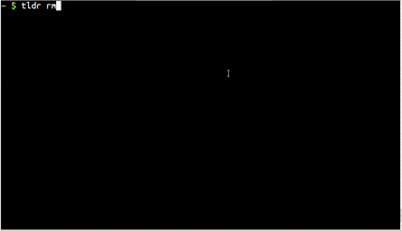
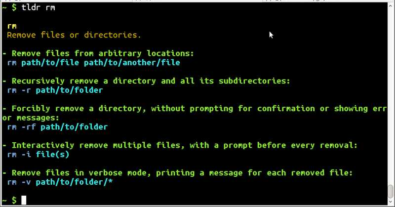
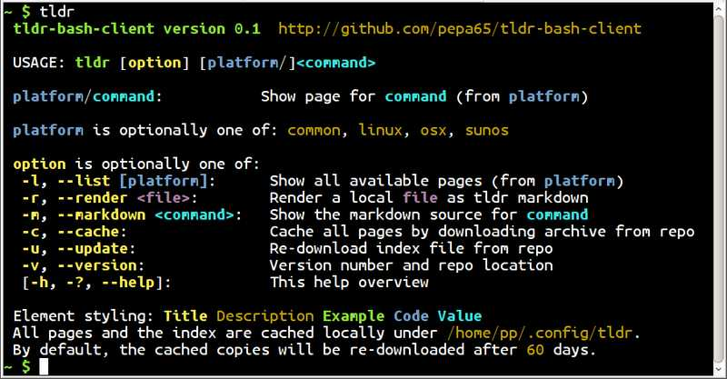
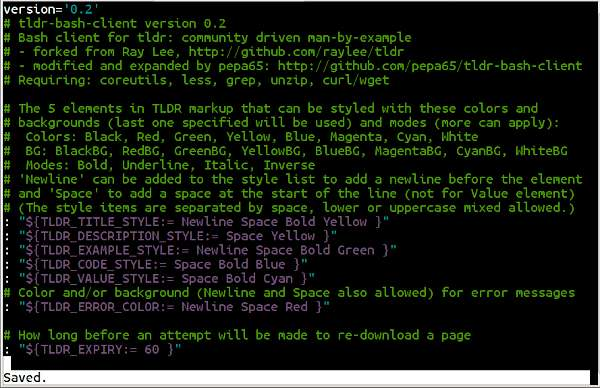
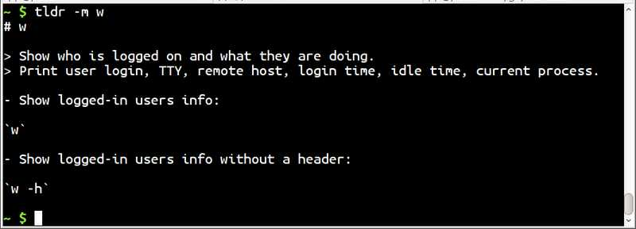
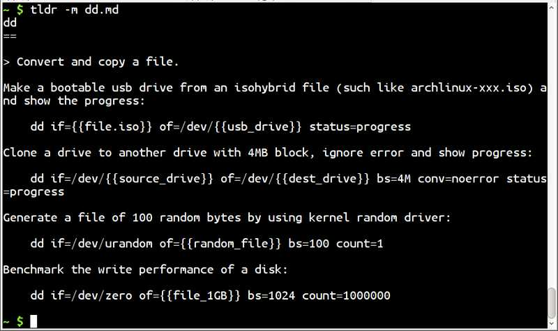

# tldr-bash-client

* version 0.31
* https://github.com/pepa65/tldr-bash-client

### Bash client for tldr: community driven man-by-example
**A fully-functional [bash](https://tiswww.case.edu/php/chet/bash/bashtop.html)
client for the [tldr](https://github.com/tldr-pages/tldr) project, providing
poignant examples of terminal commands.**


This client can render both the old and the new tldr markup format.

## Installation
Download the tldr bash script to the install location:

```bash
location=/usr/local/bin/tldr  # elevated privileges needed for some locations
sudo wget -qO $location https://raw.githubusercontent.com/pepa65/tldr-bash-client/master/tldr
sudo chmod +x $location
```

If the location is not in $PATH, you need to specify the path to run it.
Alternately, you can do `sudo bpkg-install pepa65/tldr` if you have
[bpkg](https://github.com/bpkg/bpkg) installed.




### Prerequisites
coreutils, less, grep, unzip, curl / wget



## Customisation

The 5 elements in TLDR markup that can be styled with these colors and
backgrounds (last one specified will be used) and modes (more can apply):
* Colors: Black, Red, Green, Yellow, Blue, Magenta, Cyan, White
* BG: BlackBG, RedBG, GreenBG, YellowBG, BlueBG, MagentaBG, CyanBG, WhiteBG
* Modes: Bold, Underline, Italic, Inverse

`Newline` can be added to the style list to add a newline before the element
and `Space` to add a space at the start of the line
(style items are separated by space, lower/uppercase mixed allowed)
* TLDR_TITLE_STYLE (defaults to: Newline Space Bold Yellow)
* TLDR_DESCRIPTION_STYLE (defaults to: Space Yellow)
* TLDR_EXAMPLE_STYLE (defaults to: Newline Space Bold Green)
* TLDR_CODE_STYLE (defaults to: Space Bold Blue)
* TLDR_VALUE_ISTYLE (defaults to: Space Bold Cyan)

The Value style (above) is an Inline style: doesn't take Newline or Space

Inline styles for help text: default, URL, option, platform, command, header
* TLDR_DEFAULT_ISTYLE (defaults to: White)
* TLDR_URL_ISTYLE (defaults to: Yellow)
* TLDR_HEADER_ISTYLE (defaults to: Bold)
* TLDR_OPTION_ISTYLE (defaults to: Bold Yellow)
* TLDR_PLATFORM_ISTYLE (defaults to: Bold Blue)
* TLDR_COMMAND_ISTYLE (defaults to: Bold Cyan)
* TLDR_FILE_ISTYLE (defaults to: Bold Magenta)

Color/BG (Newline and Space also allowed) for error and info messages
* TLDR_ERROR_COLOR (defaults to: Newline Space Red)
* TLDR_INFO_COLOR (defaults to: Newline Space Green)

How many days before freshly downloading a potentially stale page
* TLDR_EXPIRY (defaults to: 60)

Alternative location of pages cache
* TLDR_CACHE (not set by default)



## Contributing

Please file an issue for a question, a bug or a feature request.
Or even better, send a pull request!

[tldr-bash-client github page](http://github.com/pepa65/tldr-bash-client "github.com/pepa65/tldr-bash-client")



### License

Original client by Ray Lee http://github.com/raylee/tldr (MIT license)

Relicensed under GPLv3+


